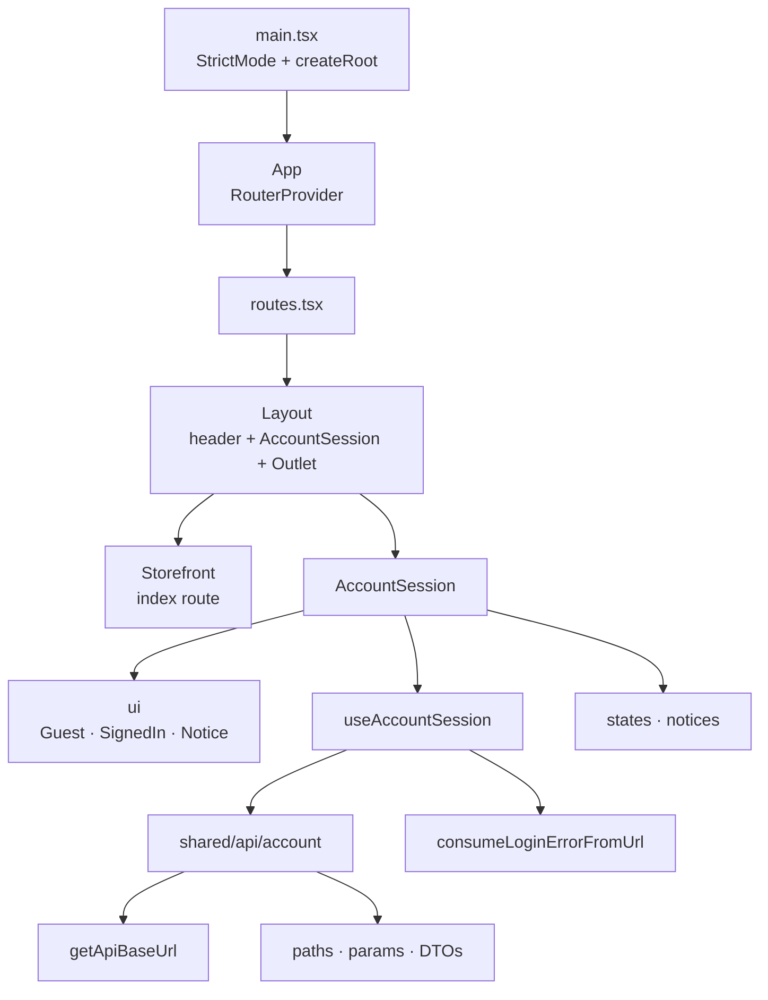
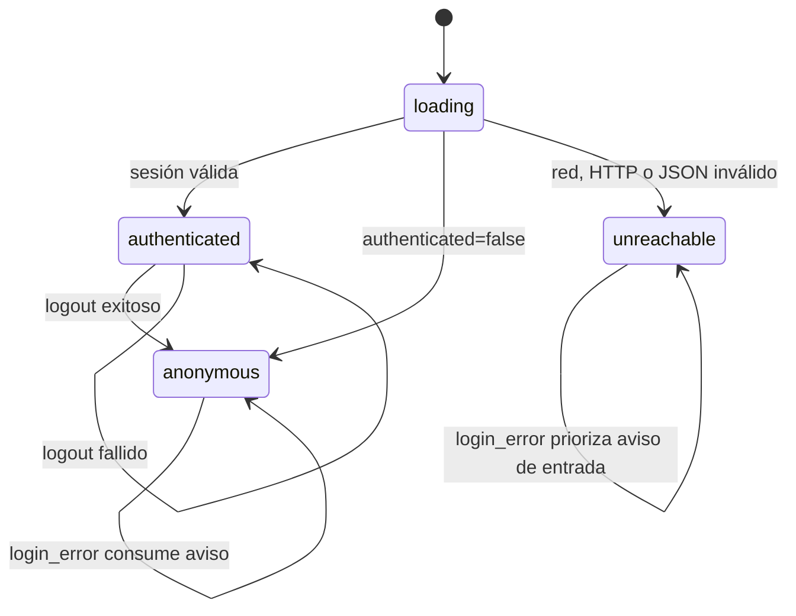
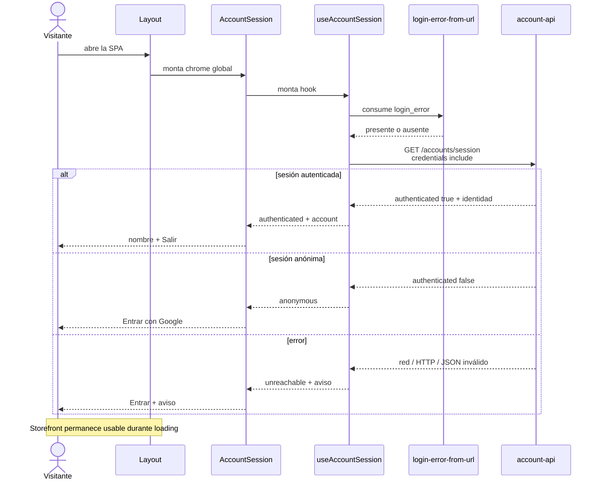
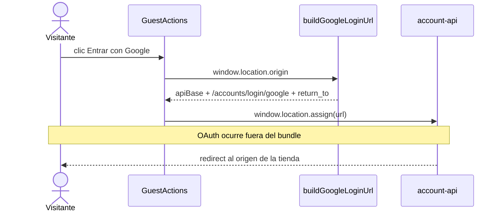
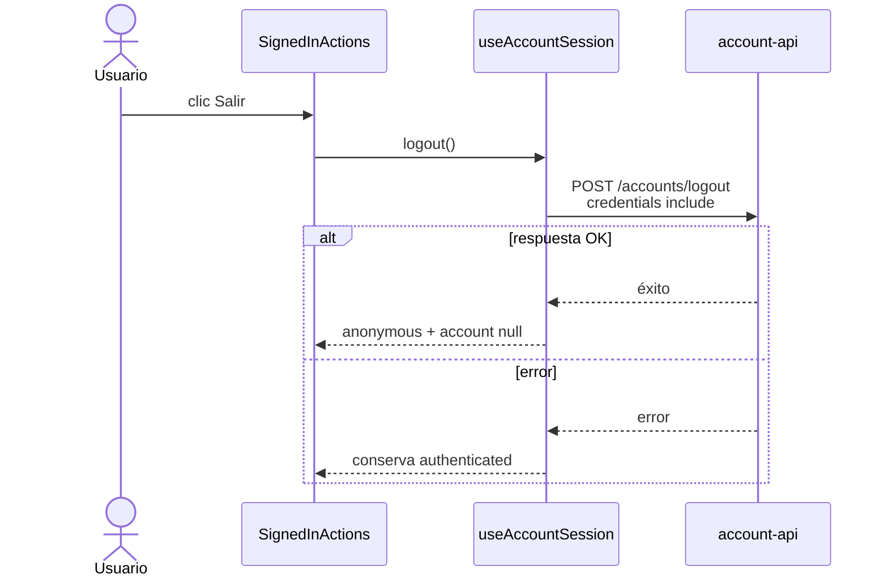

# UML 001 — Storefront con entrada Google opcional

Diagramas alineados con la implementación actual de `client-web`.

## Estructura

```text
src/app/
├── App.tsx
├── routes.tsx
├── views/
│   ├── Layout/
│   │   ├── Layout.tsx
│   │   └── Layout.test.tsx
│   └── Storefront/
│       ├── Storefront.tsx
│       └── Storefront.test.tsx
└── shared/
    ├── config/api-base-url.ts
    ├── api/account/
    │   ├── constants.ts
    │   ├── types.ts
    │   ├── get-session/
    │   ├── post-logout/
    │   └── build-google-login-url/
    └── components/AccountSession/
        ├── constants.ts
        ├── ui/
        │   ├── AccountSession.tsx
        │   ├── GuestActions.tsx
        │   ├── SignedInActions.tsx
        │   └── SessionNotice.tsx
        ├── hooks/use-account-session/
        └── lib/login-error-from-url/
```

## Composición SPA



## Estados de sesión



## Carga inicial



## Entrar con Google



## Salir



## Contrato HTTP

| Operación | Método | Path | Credenciales |
| --- | --- | --- | --- |
| Entrar con Google | GET por navegación | `/accounts/login/google?return_to=...` | Navegación completa |
| Consultar sesión | GET | `/accounts/session` | `include` |
| Salir | POST | `/accounts/logout` | `include` |
