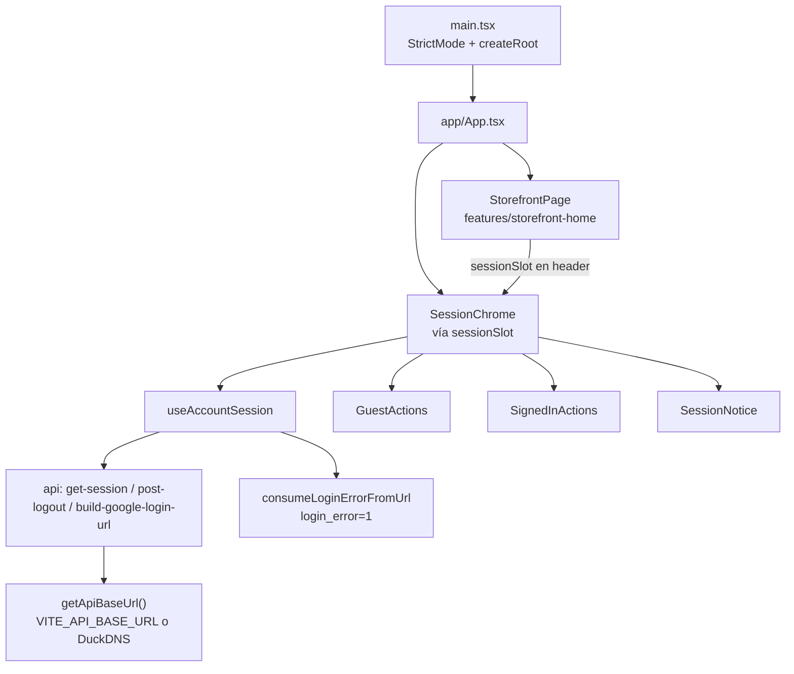
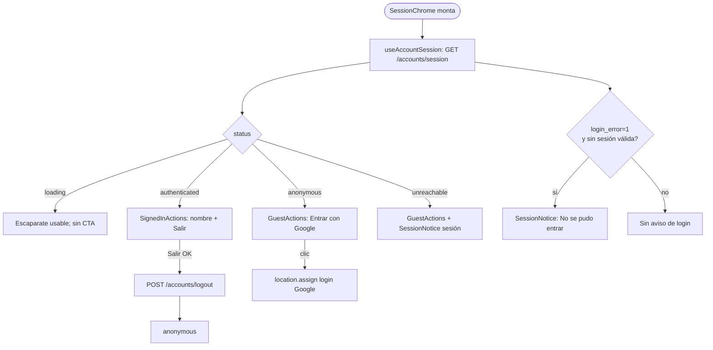
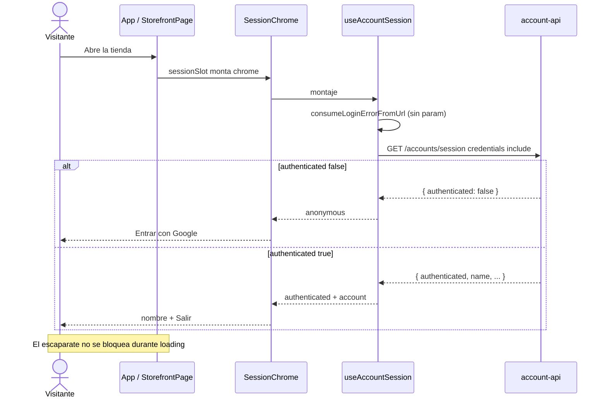
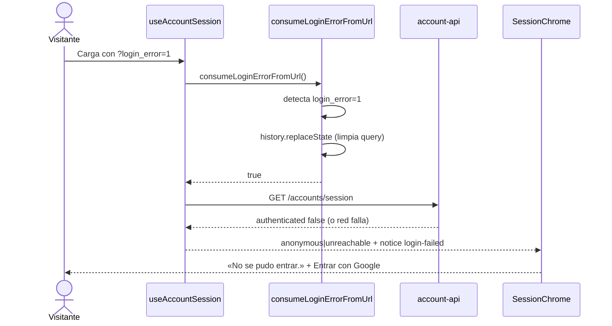
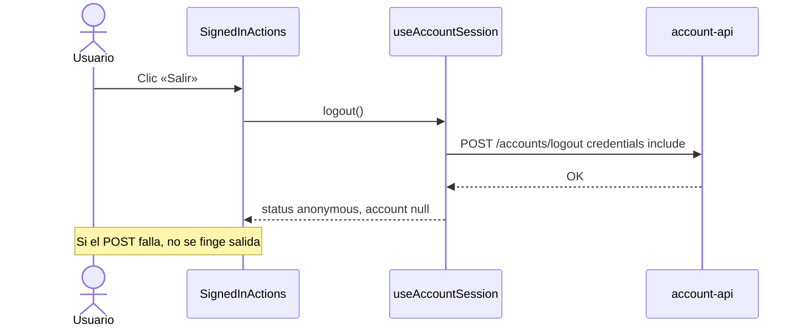
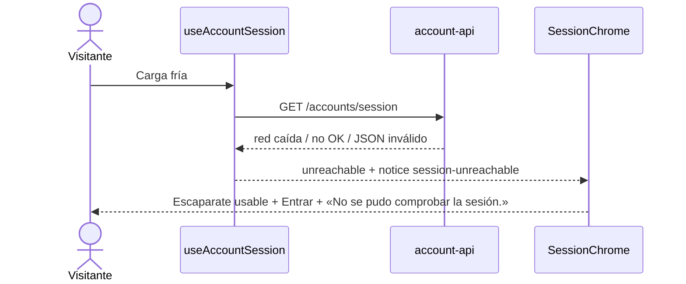

# UML 001 — Storefront con entrada Google opcional

Diagramas y prosa alineados al código de la rama `001/feat-storefront-google-login`.

## 1. Árbol de features (as-built)

`main.tsx` solo hace bootstrap (`StrictMode` + `createRoot`) e importa `styles.css` (Tailwind 4 + `@theme`). `app/App.tsx` no habla con la red: compone el escaparate y el chrome de sesión vía slot.

```text
src/
├── main.tsx
├── styles.css                        # @import "tailwindcss" + @theme (tokens)
├── vite-env.d.ts                     # VITE_API_BASE_URL?
├── test/setup.ts
├── app/
│   └── App.tsx                       # StorefrontPage + sessionSlot={SessionChrome}
├── shared/config/
│   └── api-base-url.ts               # getApiBaseUrl(); fallback DuckDNS
└── features/
    ├── storefront-home/
    │   ├── components/StorefrontPage.tsx
    │   ├── components/StorefrontPage.test.tsx
    │   └── index.ts
    └── account-session/
        ├── api/get-session.ts
        ├── api/post-logout.ts
        ├── api/build-google-login-url.ts
        ├── hooks/use-account-session.ts
        ├── lib/login-error-from-url.ts   # login_error=1
        ├── components/SessionChrome.tsx
        ├── components/GuestActions.tsx
        ├── components/SignedInActions.tsx
        ├── components/SessionNotice.tsx
        ├── types.ts
        └── index.ts                      # exporta SessionChrome (+ tipos)
```

**Base URL:** `getApiBaseUrl()` = `import.meta.env.VITE_API_BASE_URL ?? 'https://api.friendly-e-shop.duckdns.org'`. Todos los `fetch` y la URL de login Google pasan por esta función. No hay CSS colocalizado por feature: utilidades Tailwind en los componentes.

## 2. Composición en App



## 3. Flujo de componentes (chrome)



## 4. Secuencia — carga en frío (sesión OK anónima o autenticada)



## 5. Secuencia — Entrar con Google

```mermaid
sequenceDiagram
  actor U as Visitante
  participant Guest as GuestActions
  participant Build as buildGoogleLoginUrl
  participant API as account-api / Google

  U->>Guest: Clic «Entrar con Google»
  Guest->>Build: buildGoogleLoginUrl(window.location.origin)
  Build-->>Guest: {apiBase}/accounts/login/google?return_to=...
  Guest->>API: location.assign(url)
  Note over U,API: OAuth fuera del bundle; sin client id en client-web
  API-->>U: Redirect a return_to (origin de la tienda)
```

## 6. Secuencia — retorno con `login_error=1`



## 7. Secuencia — Salir



## 8. Secuencia — sesión inalcanzable


